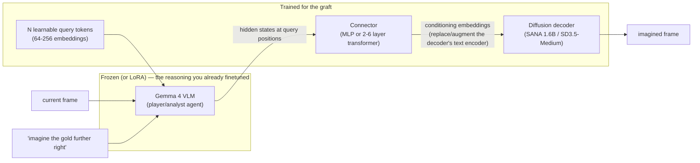

# Grafting an image decoder onto the game agent

A how-to for adding **visual imagination** to this repo's VLM agent — the
ability to answer "imagine the gold further to the right", "imagine a gold
piece right on the corner", "imagine a blue line from you to the gold" with a
*generated image*, not just prose — **without giving up current-generation
reasoning**.

Written 2026-07-24 as a planning aid. All HF repo/dataset links and arXiv ids
below were verified to resolve on that date.

---

## 0. The decision this document encodes

Three ways to get image generation into the agent:

1. **Switch to an open unified model** (BAGEL [8], Janus-Pro, Emu-line):
   one network does understanding + generation + editing. Rejected: every
   open unified model pays a reasoning tax of roughly one model generation —
   BAGEL's understanding sits at Qwen2.5-VL-7B level (MMMU ~55), well below
   the Gemma 4 / Qwen3-VL class this project depends on.
2. **Bolt a diffusion editor next to the agent** (Step1X-Edit [9],
   Qwen-Image-Edit): strong edits, but the editor's internal MLLM is a
   component, not our agent — its "reasoning" doesn't share the agent's
   memory, prompts, or finetuning.
3. **Graft a decoder onto OUR finetuned VLM** (this document): keep the
   reasoning model (a Gemma 4, finetuned over the coming month), append a
   small trainable connector + a diffusion decoder that renders images
   *conditioned on the VLM's hidden states*. This is the
   MetaQuery [1] / BLIP3-o [2] / MetaMorph [3] recipe, and it is by now a
   well-trodden path, not a research bet.

The plan: **(3)**, with a tool-based "imagination" stage first (§2) that
costs nothing and generates the training data for the graft.

---

## 1. Target architecture



How it works, in one paragraph: the query tokens are appended to the VLM's
input; the VLM processes `[frame] [instruction] [q_1..q_N]` as usual, and the
final-layer hidden states at the query positions become a summary of "what
the imagined image should contain" — computed *with* the full power of the
finetuned reasoning model, its memory context, and its understanding of the
current frame. The connector projects those N vectors into the conditioning
space of a diffusion decoder (where the text-encoder output would normally
go), and the decoder is trained (flow-matching/denoising loss) to render the
target image given that conditioning. MetaQuery [1] showed this works with
the VLM **completely frozen**; BLIP3-o [2] refined the recipe (CLIP-feature
diffusion targets, sequential training, a curated instruction set) and
released the full stack; MetaMorph [3] showed that light joint tuning of the
VLM improves generation further and that *understanding and generation
reinforce each other*. Emu2 [5] and SEED-X [4] are the earlier ancestors of
the same "LLM hidden states condition a diffusion decoder" idea.

What this buys us over the alternatives:

- The reasoning model is untouched (or LoRA-touched) — no regression risk to
  the play/debrief/self-eval behavior that took months to get right.
- The graft trains on a single A100: the trainable parts are the queries
  (~1M), the connector (~20-100M), and the decoder (1.6-2.5B, itself
  LoRA-able).
- The decoder can be swapped/upgraded independently of the agent.

The heavier alternatives — Transfusion [6] (one transformer trained on both
next-token and diffusion objectives from scratch) and LMFusion [7] (add
parallel image-FFN/attention modules to a frozen LLM) — are what you'd reach
for at pretraining scale; they are cited here for completeness, not as the
plan.

---

## 2. Stage 0 (now, zero model changes): imagination as a tool

Before any training, add an `[IMAGINE ...]` bracket tool to the harness, in
the same family as `[SEARCH]`/`[SHOW n]`:

- The model emits a structured edit request, e.g.
  `[IMAGINE gold at (0.85, 0.2)]`, `[IMAGINE line from agent to gold]`,
  `[IMAGINE after FORWARD FORWARD]`.
- The harness applies the edit to a **copy of the Settings dict**, re-renders
  with the engine, and feeds the image back as a new frame message.

This gives the *behavioral loop* (request an imagined scene → reason over
it) immediately, with pixel-exact geometry — and **every tool call is a
training triplet** (before-frame, instruction, after-frame) for the graft.
It also settles, cheaply, the key design question: *which imagination
operations does the agent actually benefit from?* Log usage, keep the
operations that earn their keep, and make those the core of the Stage-2
instruction distribution.

---

## 3. The engine is the dataset

The decisive local advantage: general image-editing models struggle with
*precise geometry* ("a little to the right" → "somewhere vaguely right"),
but this project owns a perfect paired-data generator. Every instruction
template is an edit of the Settings dict plus a re-render — unlimited,
pixel-exact, free.

Sketch (real APIs from `agent/game_io.py`):

```python
import random
from agent import game_io

def make_triplet(rng: random.Random):
    game = game_io.new_bare_game(seed=rng.randrange(2**31))
    before = game_io.game_to_settings_dict(game)
    game_io.render_frame_png(game, "before.png")

    # -- pick an instruction template and apply it to a COPY of settings
    after = dict(before)
    dx = rng.uniform(0.1, 0.3)
    after["gold"] = [[before["gold"][0][0] + dx, before["gold"][0][1]]]
    instruction = f"Imagine the gold piece moved {dx:.2f} further to the right."

    edited = game_io.game_from_settings_dict(after)
    game_io.render_frame_png(edited, "after.png")
    return "before.png", instruction, "after.png"
```

Instruction families to generate (each is a few lines of settings surgery):

| Family | Example instruction | Settings edit |
|---|---|---|
| Translate object | "imagine the gold further right / near the top wall" | move `gold[0]` |
| Place object | "imagine a gold piece right on the corner" | set `gold[0]` |
| Rotate agent | "imagine you were facing the gold / facing 3 o'clock" | set `direction` |
| Move agent | "imagine you stood at the center" | set agent position |
| Annotate | "imagine a blue line from you to the gold" | post-render draw (PIL) |
| Future frame | "imagine the board after [FORWARD]" | `apply_action` on a copy, re-render |
| Counterfactual chain | "imagine the board after [CLOCK] x5 then [FORWARD]" | apply sequence |

Notes:

- **Annotation** ops (lines, markers, highlights) are drawn on the rendered
  PNG with PIL rather than through the engine — still exact, still free.
- **Paraphrase the instructions** with the agent model itself (it's idle
  between training runs): 5-10 phrasings per template guards the connector
  against overfitting to one grammar.
- Also emit each triplet's *after* Settings dict to disk. That is the ground
  truth for the geometric eval (§6) — this domain can be evaluated exactly,
  which almost no image-generation project can say.
- Volume: 100K-1M triplets is cheap (rendering is the bottleneck; the engine
  renders 768x768 frames in milliseconds). MetaQuery-class connectors were
  trained on ~25M generic pairs; a narrow domain needs orders of magnitude
  less, and BLIP3-o's entire released instruction-SFT set is 60K pairs [D1].

---

## 4. The graft, step by step

### 4.1 Components and sizes

| Part | Choice | Params | Trained? |
|---|---|---|---|
| VLM | Gemma 4 (E4B or 12B, post-finetuning) | 4.5-12B | frozen (Stage A/B), optional LoRA (Stage C) |
| Query tokens | 64 (start) to 256 embeddings | ~0.3-1M | yes |
| Connector | 2-6 transformer layers or wide MLP | 20-100M | yes |
| Decoder | see §5 | 1.6-2.6B | LoRA first, full later |

### 4.2 Getting the conditioning out of Gemma

HF `transformers` makes the hook trivial — no model surgery:

```python
out = vlm_model(
    **inputs_with_query_tokens,   # [frame] [instruction] [q_1..q_N]
    output_hidden_states=True,
)
h = out.hidden_states[-1][:, -N_QUERY:, :]   # (B, N, d_vlm)
cond = connector(h)                          # (B, N, d_decoder_cond)
```

The query tokens are N new rows in a small `nn.Embedding`, appended to
`inputs_embeds` — the base vocabulary/checkpoint is untouched. The decoder's
cross-attention consumes `cond` where its text-encoder sequence would
normally go (for SANA/SD3-class decoders: replace the T5/CLIP embedding
sequence; keep the decoder's own VAE).

### 4.3 Training stages

**Stage A — connector alignment (VLM frozen, decoder frozen).**
Task: caption → image over engine renders ("a board with gold at the lower
right, agent at center facing 2 o'clock" → frame). Programmatic captions
from the Settings dict. Trains queries + connector only (~1-2 days of A100
time at this scale, likely less). Goal: the decoder reproduces board layouts
from conditioning alone. If this stage can't nail geometry, fix it here
before adding instructions — nothing downstream will repair it.

**Stage B — instruction editing (VLM frozen, decoder LoRA).**
Task: (before-frame + instruction) → after-frame, on the §3 triplets, mixed
~10:1 with Stage-A caption data (prevents the connector from drifting off
plain generation). This is the stage that delivers the user-facing feature.

**Stage C (optional) — light joint tuning (VLM LoRA).**
MetaMorph [3] found modest gains in generation fidelity from letting the VLM
move; the risk is reasoning regression. Mitigations: LoRA only, mix in
text-only play/debrief SFT data, and gate the stage on the §6 reasoning
evals staying flat. Skip it entirely if Stage B is good enough.

### 4.4 Loss

Whatever the chosen decoder trains with natively — flow matching for
SANA/SD3-class models. Standard trick set: train at the decoder's native
resolution (crop/resize the 768x768 frames), classifier-free guidance by
dropping the conditioning ~10% of steps, EMA on trainable weights.
BLIP3-o's ablation [2] found diffusing *CLIP image features* instead of VAE
latents transfers better across domains — worth reading, probably
unnecessary at this domain's simplicity.

---

## 5. Decoder candidates (all verified on HF, 2026-07-24)

| Decoder | Params | License | Notes |
|---|---|---|---|
| [`Efficient-Large-Model/Sana_1600M_1024px_BF16_diffusers`](https://huggingface.co/Efficient-Large-Model/Sana_1600M_1024px_BF16_diffusers) [10] | 1.6B | Apache-2.0 (code; check model card) | **First choice.** Linear-attention DiT, very fast, trains comfortably on one A100 next to a frozen Gemma. |
| [`stabilityai/stable-diffusion-3.5-medium`](https://huggingface.co/stabilityai/stable-diffusion-3.5-medium) | 2.6B | Stability Community License | Solid fallback; MMDiT; free under $1M revenue, read the license. |
| [`black-forest-labs/FLUX.1-schnell`](https://huggingface.co/black-forest-labs/FLUX.1-schnell) | 12B | Apache-2.0 | Highest ceiling, but 12B of decoder next to a 12B VLM is a squeeze on one A100 — QLoRA territory. The `-dev` sibling has a non-commercial license; avoid. |

For flat 2D boards with ~5 objects, SANA 1.6B is almost certainly
sufficient, and its speed matters: imagination calls sit inside an
interactive loop.

---

## 6. Evaluation — use the unfair advantage

**Geometric eval (primary).** Because every training instruction came from a
Settings edit, the *exact* expected geometry is known. Evaluate generated
frames by extracting objects back out (the renderer's colors are constants:
green agent, red eye, yellow gold — a few lines of thresholding, no ML) and
scoring:

- gold-position error (L2, board units) vs. the target Settings;
- agent position/direction error where the instruction touches them;
- false objects added / objects lost (count mismatch);
- for annotation ops: line endpoints within tolerance.

Report per instruction-family. This is a *real* metric with a zero point —
guard the whole project with it. A generated image whose extracted settings
match the target is correct, full stop.

**Reasoning regression eval (gate for Stage C).** The existing self-eval
harness IS the benchmark: fixed boards + `DEFAULT_PLAYER_QUESTION`, analyst
scores before vs. after any stage that touches VLM weights.

**Generic benchmarks (optional, for calibration only).** GenEval [11] for
compositional generation; GEdit-Bench / KRIS-Bench (from the Step1X-Edit
line [9]) for editing. Useful to know where the graft stands vs. the field;
not targets.

---

## 7. Public datasets (secondary to the engine, but useful)

The engine supplies the primary data. Public sets are useful for (a)
regularizing the connector so it doesn't collapse onto board-world, (b)
warming up Stage A/B before engine-specific tuning, (c) free instruction
paraphrase distributions.

| Dataset | Size | What it is |
|---|---|---|
| [`BLIP3o/BLIP3o-60k`](https://huggingface.co/datasets/BLIP3o/BLIP3o-60k) [D1] | 60K | Curated prompt→image instruction-SFT set from the BLIP3-o release [2]; small, high quality — the right shape for Stage A warm-up. |
| [`TIGER-Lab/OmniEdit-Filtered-1.2M`](https://huggingface.co/datasets/TIGER-Lab/OmniEdit-Filtered-1.2M) [D2] | 1.2M | Instruction-based editing triplets built by specialist models [12]; the best general editing warm-up for Stage B. |
| [`BleachNick/UltraEdit`](https://huggingface.co/datasets/BleachNick/UltraEdit) [D3] | ~4M | Large-scale fine-grained editing, includes region-based edits [13]. |
| [`Bin1117/AnyEdit`](https://huggingface.co/datasets/Bin1117/AnyEdit) [D4] | 2.5M | 25 edit types incl. *viewpoint and implicit edits* [14] — closest public analog to the counterfactual family. |
| [`timbrooks/instructpix2pix-clip-filtered`](https://huggingface.co/datasets/timbrooks/instructpix2pix-clip-filtered) [D5] | ~310K | The original synthetic editing set [15]; historically important, weaker than the above. |
| [`Alex11556666/Reason_Tuning`](https://huggingface.co/datasets/Alex11556666/Reason_Tuning) [D6] | — | UniReason's interleaved *reasoning→generation* tuning data (2026) [16]; relevant if imagination should emit a reasoning trace before the image. |
| [`shiyi0408/Meta-CoT-21-Tasks-Bench`](https://huggingface.co/datasets/shiyi0408/Meta-CoT-21-Tasks-Bench) [D7] | bench | 21-task editing benchmark from Meta-CoT (2026) [17]; eval, not training. |
| SEED-Data-Edit (AILab-CVC) | 3.7M | Multi-round editing w/ human annotation; **gated** on HF (request access) [4-adjacent]. |

---

## 8. Compute and schedule sketch (one A100 80GB)

| Stage | Trainable | Memory picture | Wall-clock guess |
|---|---|---|---|
| 0: tool imagination | none | — | a day of harness work |
| Data gen (§3) | none | CPU-bound | hours for 100K-1M triplets |
| A: connector | ~100M + queries | frozen 4.5-12B VLM (bf16) + 1.6B decoder + optimizer on 100M → fits with grad checkpointing | 1-3 days |
| B: + decoder LoRA | +~50-100M LoRA | same ballpark | 2-5 days |
| C: + VLM LoRA (optional) | +~50-200M LoRA | tightest; consider 8-bit optimizer, or E4B instead of 12B | 2-5 days |

Practical notes: precompute and cache the VLM hidden states for Stage A
(frozen VLM = the conditioning for a fixed dataset never changes; turns
Stage A into training a 100M-param model against cached tensors — hours,
not days). Stage B needs live VLM forward passes only if instructions are
paraphrased on the fly; a fixed paraphrase set can be cached the same way.

---

## 9. Risks and open questions

1. **Gemma 4 12B "Unified" wrinkle.** The 12B is encoder-free — raw patches
   go straight into the decoder stack. That makes its hidden states, if
   anything, *more* image-native (good for conditioning), but nobody has
   published a MetaQuery-style graft on it yet. The E4B (standard encoder)
   is the more conservative substrate. This choice rides on the Monday
   E4B-vs-12B decision; the graft recipe is identical either way.
2. **Conditioning bottleneck.** 64 query tokens may under-specify scenes
   with many objects. Board-world has ~5 objects, so this is unlikely to
   bite; if it does, raise N before touching anything else (MetaQuery
   ablates N=64→256 with monotone gains [1]).
3. **Precision ceiling of diffusion decoders.** Even with perfect
   conditioning, diffusion may place the gold 2-3 pixels off. The geometric
   eval (§6) measures this directly; the mitigation ladder is: more Stage-A
   data → larger N → fine-tune decoder fully (not LoRA) → swap decoder.
4. **Don't let imagination leak privileged data.** The imagined frames come
   from Settings edits; the *frames* are fair game for the player, but the
   numeric Settings dicts behind them must stay scrubbed in player-facing
   memory, same as live frames (existing invariant, one more place to
   enforce it).
5. **Interactive latency.** SANA at 768px is ~1s/image on an A100; SD3.5-M
   several seconds. Fine for the notebooks; revisit if imagination moves
   into the inner play loop.

---

## 10. Bibliography

Methods:

- [1] MetaQuery — *Transfer between Modalities with MetaQueries*,
  [arXiv:2504.06256](https://arxiv.org/abs/2504.06256). The core recipe:
  frozen MLLM + learnable queries + tuned diffusion decoder.
- [2] BLIP3-o — *A Family of Fully Open Unified Multimodal Models*,
  [arXiv:2505.09568](https://arxiv.org/abs/2505.09568). Fully open stack +
  training recipe + data ([model](https://huggingface.co/BLIP3o/BLIP3o-Model-8B)).
- [3] MetaMorph — *Multimodal Understanding and Generation via Instruction
  Tuning*, [arXiv:2412.14164](https://arxiv.org/abs/2412.14164). VPiT; joint
  tuning helps; understanding and generation reinforce each other.
- [4] SEED-X — *Multimodal Models with Unified Multi-granularity
  Comprehension and Generation*,
  [arXiv:2404.14396](https://arxiv.org/abs/2404.14396).
- [5] Emu2 — *Generative Multimodal Models are In-Context Learners*,
  [arXiv:2312.13286](https://arxiv.org/abs/2312.13286). Early
  LLM-conditions-diffusion evidence.
- [6] Transfusion — *Predict the Next Token and Diffuse Images with One
  Multi-Modal Model*, [arXiv:2408.11039](https://arxiv.org/abs/2408.11039).
- [7] LMFusion — *Adapting Pretrained Language Models for Multimodal
  Generation*, [arXiv:2412.15188](https://arxiv.org/abs/2412.15188).
- [8] BAGEL — *Emerging Properties in Unified Multimodal Pretraining*,
  [arXiv:2505.14683](https://arxiv.org/abs/2505.14683)
  ([weights](https://huggingface.co/ByteDance-Seed/BAGEL-7B-MoT)). The
  unified-model baseline this plan declined.
- [9] Step1X-Edit — *A Practical Framework for General Image Editing*,
  [arXiv:2504.17761](https://arxiv.org/abs/2504.17761); v1p2 "ReasonEdit-S"
  adds a thinking-editing-reflection loop
  ([weights](https://huggingface.co/stepfun-ai/Step1X-Edit-v1p2)).
- [10] SANA — *Efficient High-Resolution Image Synthesis with Linear
  Diffusion Transformers*,
  [arXiv:2410.10629](https://arxiv.org/abs/2410.10629).
- [11] GenEval — *An Object-Focused Framework for Evaluating Text-to-Image
  Alignment*, [arXiv:2310.11513](https://arxiv.org/abs/2310.11513).
- [16] UniReason 1.0 — *A Unified Reasoning Framework for World Knowledge
  Aligned Image Generation and Editing*,
  [arXiv:2602.02437](https://arxiv.org/abs/2602.02437)
  ([repo](https://github.com/AlenjandroWang/UniReason)).
- [17] Meta-CoT — two-level CoT decomposition for image editing over BAGEL
  ([repo](https://github.com/shiyi-zh0408/Meta-CoT)).

Datasets:

- [12] OmniEdit — [arXiv:2411.07199](https://arxiv.org/abs/2411.07199).
- [13] UltraEdit — [arXiv:2407.05282](https://arxiv.org/abs/2407.05282).
- [14] AnyEdit — [arXiv:2411.15738](https://arxiv.org/abs/2411.15738).
- [15] InstructPix2Pix —
  [arXiv:2211.09800](https://arxiv.org/abs/2211.09800).
- [D1-D7] Hugging Face dataset links inline in §7 (all verified
  2026-07-24; SEED-Data-Edit is gated).
