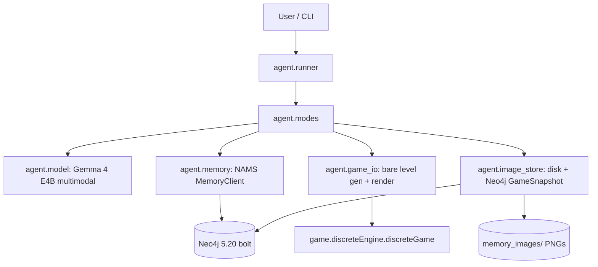
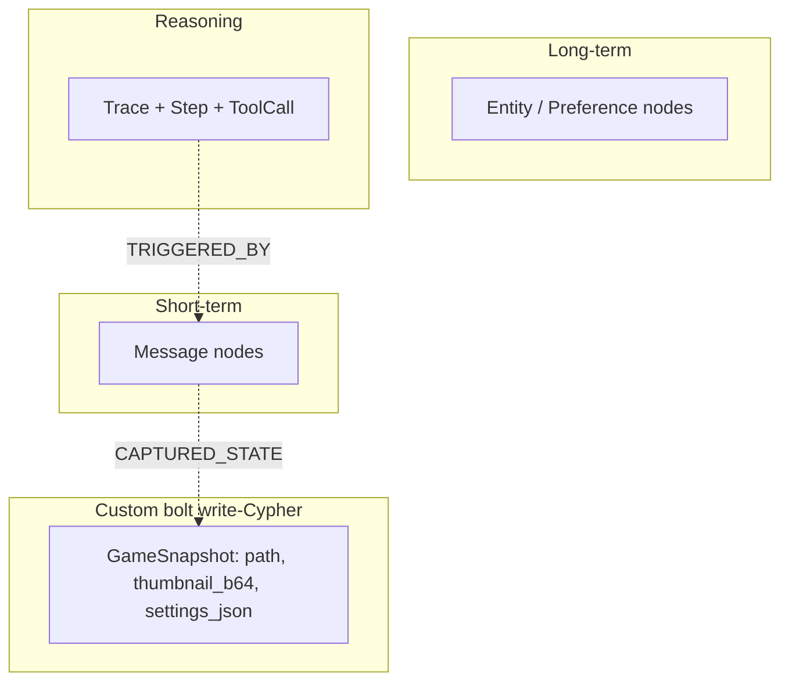

# game_saddle

A Gemma 4 E4B multimodal agent that plays a small 2D discrete game, with
persistent, graph-shaped memory backed by the **Neo4j Agent Memory System
(NAMS)** running locally over Bolt. No external DB, no NAMS API key, no
cloud LLM provider.

The game itself lives in `game/discreteEngine.py`. Its world is **y-up**
(larger y = higher on screen, as in ordinary graphs) and the facing angle
theta is a **compass bearing**: 0 = straight up (12 o'clock), measured
**clockwise** on screen — the engine, the Settings JSON, and every prompt
share this one convention (see the docstring of `agent/game_io.py`). For now the agent only sees **bare
levels**: four boundary walls, exactly one gold piece near the agent,
generated via `discreteGame.random_bare_settings()`. See `FUTURE_GOALS.md`
for what is deliberately deferred.

## What it does

Three modes:

| Mode    | Command                          | What happens                                                                                                                                                |
|---------|----------------------------------|--------------------------------------------------------------------------------------------------------------------------------------------------------------|
| 1 game  | `python -m agent.runner game …`  | The agent sees a game screen **image** + a user question. It answers the question, makes one move, or (with `--solve`) loops moves until the gold is eaten. |
| 2 discuss | `python -m agent.runner discuss …` | Open-ended chat. The agent has **full access** to the entire memory DB. Use this to bootstrap the semantic model and to evaluate the agent conversationally. |
| 3 eval  | `python -m agent.runner eval …`  | Self-evaluation: looks at a recorded `Conversation` + its `Reasoning` traces + the `Settings` dict at each step, and writes a verdict back onto the same conversation. |

Available moves in mode 1: `CLOCK` (turn clockwise by π/30),
`ANTICLOCK` (turn counter-clockwise by π/30), `FORWARD` (advance up to
1/16 of the board in the facing direction).

## Architecture



### NAMS memory tiers and how we use them



* **short_term** — the conversation: user questions + assistant
  moves/answers (one `Message` per turn).
* **reasoning** — per-move `Trace` with a `Step` (thought = the model's
  raw output) and a `ToolCall` (tool name = `CLOCK`/`ANTICLOCK`/`FORWARD`,
  result = `{gold_collected: k}`). Mode 3 starts its own trace for the
  evaluation reasoning.
* **long_term** — a small semantic model of the game, seeded once by
  `python -m agent.runner seed`: entities (`Agent`, `Gold`,
  `BoundaryWall`, `DiscreteGame`, `Direction`) and preferences / tips
  (controls, geometry, goal, facing/distance/overshoot heuristics). We add
  these manually so NAMS needs **no LLM provider** (no `llm=` is passed),
  keeping the whole stack local.
* **`GameSnapshot` (custom)** — written via `client.graph.execute_write`
  (bolt-only). Holds the filesystem `path`, `width`, `height`, a 64×64
  base64 PNG `thumbnail_b64`, and the full `settings_json`. Linked to the
  corresponding `Message` by `(:Message)-[:CAPTURED_STATE]->(:GameSnapshot)`.

### Per-move data flow (mode 1)

1. Render the current frame to `memory_images/<sid>/<snapshot_id>.png`;
   write a `GameSnapshot` node with `settings_json`.
2. Store the user question as a `Message` (role=user), linked to that
   snapshot via `CAPTURED_STATE {role:'before'}`.
3. Retrieve NAMS context with settings-leaking fields stripped
   (`agent.memory.get_game_context`).
4. Build the chat: system prompt + context + image + question; call Gemma
   4 E4B.
5. Parse the first `CLOCK|ANTICLOCK|FORWARD` keyword; if found, apply the
   move to the engine.
6. Store the assistant `Message`; start a reasoning `Trace`, add a `Step`
   (thought=raw output), `record_tool_call` (action, gold_collected),
   `complete_trace`.
7. Render the post-move frame; write an `after` `GameSnapshot`; link it to
   the assistant message via `CAPTURED_STATE {role:'after'}`.
8. For `--solve`: loop until `len(game.settings.gold) == 0` (or
   `MAX_SOLVE_STEPS`). Recompute context with the new image each step.

**The `settings_json` is stored on the `GameSnapshot` node but is never
injected into the agent prompt in mode 1.** Mode 3 is the only mode that
sees Settings.

## Setup

1. **Python deps.** Use the setup script — it runs `pip install` **and**
   downloads the entity-extraction model weights that pip can't
   (spaCy's `en_core_web_sm` and GLiNER's weights). NAMS runs a spaCy → GLiNER
   extraction pipeline on every stored message, so without these you'll see
   `Stage 'SpacyEntityExtractor' failed` / `Stage 'GLiNEREntityExtractor'
   failed` on every run and no entities get auto-discovered:

   ```bash
   bash scripts/setup_env.sh
   ```

   If your host has NVIDIA driver < 580 (CUDA ≤ 12.x), install torch from
   the CUDA 12 index first, then run the setup script with `SKIP_TORCH=1`
   (see the note at the top of `requirements.txt`):

   ```bash
   pip install -U "torch>=2.7" torchvision torchaudio \
       --index-url https://download.pytorch.org/whl/cu124
   SKIP_TORCH=1 bash scripts/setup_env.sh
   ```

2. **Local Neo4j.** Either start the bundled compose stack:

   ```bash
   NEO4J_PASSWORD=changeme docker compose up -d neo4j
   ```

   …or point at an existing instance by setting `NEO4J_URI` /
   `NEO4J_PASSWORD` in `.env` (see `.env.example`) and skipping
   `docker compose up`. Bolt runs on `bolt://localhost:7687`; the browser
   UI is at `http://localhost:7474`.

   **Bare-metal Neo4j (no Docker, e.g. Vast.ai).** Rented GPU boxes often
   don't run a Docker daemon inside the container. Use the helper scripts in
   `scripts/` to run Neo4j directly instead:

   ```bash
   # Idempotent: installs Neo4j + OpenJDK 17 (if missing), configures bolt +
   # APOC, sets the password, starts the server, and writes the connection
   # vars into .env. Re-runnable.
   bash scripts/vast_neo4j_launch.sh

   # Sanity-check connectivity (direct bolt + a NAMS get_context round-trip):
   python scripts/neo4j_connect_diagnostic.py
   ```

   The password defaults to `changeme` (matching `.env.example`); override
   with `NEO4J_PASSWORD=… bash scripts/vast_neo4j_launch.sh`.

   Manage the bare-metal database with `scripts/neo4j_db.sh`:

   ```bash
   bash scripts/neo4j_db.sh status              # running state + bolt + node counts by label
   bash scripts/neo4j_db.sh save logs/mem.dump  # snapshot the graph (non-destructive)
   bash scripts/neo4j_db.sh wipe                # delete the graph, keep the password
   bash scripts/neo4j_db.sh load logs/mem.dump  # restore a saved graph
   ```

3. **Env file — the one place for credentials and config.**

   ```bash
   cp .env.example .env
   # edit .env: set NEO4J_PASSWORD, HF_TOKEN (Gemma weights are gated),
   # optionally GEMMA_MODEL_ID, ...
   ```

   Setting variables in `.env` is **enough**: everything that runs Python —
   the runner, the notebooks, and `scripts/setup_env.sh`'s model
   downloads — loads the repo-root `.env` via `python-dotenv` (anchored to
   the repo, not the cwd). There is no need to `export` OS environment
   variables or run `huggingface-cli login`. (Exported shell variables
   still work and take precedence if you have them, since `load_dotenv`
   does not override existing environment values.)

   If you copy an existing `.env` onto a fresh box, do it **before**
   running `scripts/setup_env.sh` so the HuggingFace downloads
   authenticate with your `HF_TOKEN`.

   The only exceptions are the pure-bash Neo4j admin scripts
   (`vast_neo4j_launch.sh`, `neo4j_db.sh`): they default to the
   `.env.example` password `changeme`, so pass
   `NEO4J_PASSWORD=… bash scripts/…` only if you changed it.
   `vast_neo4j_launch.sh` writes the connection vars it used into `.env`
   for you.

4. **Seed the semantic model** (run once):

   ```bash
   python -m agent.runner seed
   ```

## Usage

```bash
# Mode 1: ask one question about a fresh bare level
python -m agent.runner game --question "is the gold to your left or your right?"

# Mode 1: make the best move (single move)
python -m agent.runner game --question "make the best move"

# Mode 1: solve the game (loop moves until the gold is eaten)
python -m agent.runner game --question "solve the game" --solve

# Mode 2: open-ended discussion (full memory access)
python -m agent.runner discuss --text "What did you learn about CLOCK vs ANTICLOCK?"

# Mode 3: self-evaluate a recorded session
python -m agent.runner eval --session <session_id_printed_by_game>
```

`--session` is optional for `game` / `discuss` (a fresh UUID-based id is
generated and printed in the JSON output). `--session` is required for
`eval`.

## Logs & DB dumps

Logging is **on by default**. Every entry point (`InteractiveSession`, the
`game` / `discuss` / `eval` runner commands) creates a fresh, timestamped run
directory under `logs/` — e.g. `logs/play_2026-07-10_16-25-07/` — and writes:

* `llm_calls.{jsonl,txt}` — **every `model.generate` call**: the exact input
  (messages + the chat-templated `rendered_prompt`), sampling params, and the
  raw output. The `.jsonl` is the machine-readable source of truth; the `.txt`
  is a banner-delimited, human-readable transcript (same order).
* `db_retrieval.{jsonl,txt}` — **every memory retrieval**: which function
  (`get_recent_messages`, `client.get_context`, `get_semantic_model`,
  `_fetch_session_traces`), its arguments, and the result.

Logging never breaks a run — any write failure degrades to a one-time warning.
The implementation is [`agent/run_logging.py`](agent/run_logging.py); disable it
per session with `InteractiveSession(enable_logging=False)`.

**DB dump.** Snapshot the whole memory graph (all nodes + relationships) to a
`.dump` JSON file in the run directory, over the *live* bolt connection (does
**not** stop Neo4j, so it is safe mid-session). Embedding vectors are dropped by
default. From the `play.ipynb` **"Dump DB status"** cell, from a session
(`session.dump_db()`), or from the shell:

```bash
python -m agent.runner dump                 # -> logs/dump_<stamp>/db_snapshot_<stamp>.dump
python -m agent.runner dump --out my.dump    # explicit path
python -m agent.runner dump --embeddings     # keep the (large) embedding vectors
```

This logical JSON dump is for inspection/analysis and is distinct from the
native binary `neo4j-admin database dump` produced by `scripts/neo4j_db.sh save`
(which requires stopping Neo4j and is only loadable by `neo4j-admin`).

`logs/` and `*.dump` are git-ignored.

## Interactive notebooks

Two Jupyter notebooks live in `notebooks/`. Install the extra deps
(`pip install -r requirements.txt` pulls in `ipywidgets` and `pyvis`) and
launch Jupyter from the repo root:

```bash
jupyter notebook   # or: jupyter lab
```

* **`notebooks/play.ipynb`** — interactive mode-1 play. It holds **one
  persistent game** and **one conversation thread**. Asking the agent to play
  starts a **multi-move turn**: it sees the *current* live frame plus its
  (settings-stripped) memory context and emits a move token (`[CLOCK]`,
  `[ANTICLOCK]`, `[FORWARD]`). Generation is stopped early the instant that token
  appears (HF `stop_strings`), the move is applied, and — because a move does
  *not* end the turn — the board is re-rendered and fed back so it keeps moving
  (`[CLOCK] [CLOCK] [FORWARD] ...`). The turn ends when the agent finishes a
  reply without a move token (Gemma's native `<end_of_turn>`), collects the gold,
  or hits the step cap (`MAX_SOLVE_STEPS`). You watch every intermediate frame
  and move live. A
  **"Restart conversation"** button re-initializes the env (a fresh bare level)
  and starts a new `session_id`. To discard an unwanted conversation and get
  back to the "semantic seeding only" state, either run the notebook's gated
  reset cell (`session.reset_memory_to_seed()`) or, from a shell,
  `bash scripts/reset_semantics.sh` (wipe + reseed). The heavy lifting lives in
  [`agent/interactive.py`](agent/interactive.py) (`InteractiveSession`),
  which runs the async NAMS client on a background event loop so the
  synchronous ipywidgets buttons can drive it. The mode-1 privacy invariant
  holds: the Settings dict is never fed to the model here.

* **`notebooks/visualize_memory.ipynb`** — an interactive view of the memory
  graph via [`pyvis`](https://pyvis.readthedocs.io/). Pan/zoom/drag through all
  `Message`, `GameSnapshot`, `Trace`/`Step`/`ToolCall`, `Entity`, and
  `Preference` nodes and their relationships, with per-label captions and
  colors; hover a node to see its full property set. Set `SESSION_ID` in the
  per-session cell to scope the view to a single conversation. The graph is
  rendered as a self-contained `<iframe srcdoc>` with vis.js inlined, so it
  needs **no** Jupyter widget frontend extension (works in JupyterLab and
  Notebook 7, online or offline).

The play notebook's buttons do use `ipywidgets`; if they don't render, ensure
`ipywidgets` is installed in the same environment as the Jupyter server
(Notebook 7+ / JupyterLab 4+ ship the widget manager by default).

## Storing images in Neo4j: the approach used here

Neo4j's documented anti-pattern is storing large blobs (base64 PNGs, raw
byte arrays) as node properties — large properties force overflow record
chains and turn every node read into many extra disk I/Os. The
recommended practice is to store the binary on an external system
(filesystem / S3) and keep only a reference on the node.

We adopt the **hybrid** recommended option:

* the **full-resolution PNG** lives on disk under
  `memory_images/<session_id>/<snapshot_id>.png`;
* the `GameSnapshot` node stores the filesystem `path`, `width`,
  `height`, a small **64×64 base64 PNG thumbnail** in `thumbnail_b64`
  (small enough to avoid the BLOB penalty, big enough to preview in Neo4j
  Browser), and the full `settings_json`.

So the binary never bloats the property store, but you can still eyeball
each frame inline in the Neo4j Browser using `thumbnail_b64` (e.g. render
with `apoc.load.jpg` / a data-URI renderer), and the agent harness always
has the high-res frame on disk for re-feeding into Gemma 4 E4B.

## Schema sketch

```
(:Message {id, session_id, role, content, metadata, created_at})
(:GameSnapshot {id, session_id, path, width, height, thumbnail_b64,
                settings_json, label, created_at})
(:Trace {id, session_id, task, ...})          // NAMS reasoning
(:Step  {id, thought, ...})
(:ToolCall {tool, args, result, ...})
(:Entity {name, type, ...})                   // NAMS long-term POLE+O
(:Preference {category, preference, ...})

(:Message)-[:CAPTURED_STATE {role:"before"|"after"}]->(:GameSnapshot)
(:Trace)-[:TRIGGERED_BY]->(:Message)
```

## Notes / limitations

* Only **bare levels** (4 boundary walls + 1 gold piece, via
  `random_bare_settings`) are generated for now. Generalisation to
  interior walls / multi-gold is tracked in `FUTURE_GOALS.md`.
* Only **image + text** modalities of Gemma 4 E4B are used. Audio and
  video are tracked in `FUTURE_GOALS.md`.
* **Automatic finetuning dataset generation** from mode 1 + mode 3 is a
  future objective, not implemented here; see `FUTURE_GOALS.md`.
* The project is **local bolt-only by design**: there is no plan to add
  the hosted NAMS service or any external API key.
* The game package (`game/discreteEngine.py`, `game/levels/skeleton.py`)
  is owned by this repo and follows the y-up / clockwise-theta convention
  documented in `agent/game_io.py`; keep engine edits convention-consistent.

## Project layout

```
agent/
  __init__.py
  config.py          # env-driven AgentConfig
  model.py           # Gemma 4 E4B multimodal wrapper
  game_io.py         # bare level gen, Settings <-> dict, render to PNG, apply_action
  image_store.py     # disk PNG + 64x64 thumbnail b64 + GameSnapshot node + linking
  memory.py          # NAMS MemoryClient factory; context stripping; semantic-model seed; DB dump
  modes.py           # mode_game / mode_discuss / mode_self_eval
  interactive.py     # InteractiveSession: persistent-game mode-1 for notebooks
  run_logging.py     # per-run LLM-call + DB-retrieval logs (on by default)
  runner.py          # CLI
notebooks/
  play.ipynb            # interactive mode-1 play (Ask + Restart conversation)
  visualize_memory.ipynb# pyvis interactive graph of the memory graph
scripts/
  vast_neo4j_launch.sh       # bare-metal Neo4j setup (no Docker; Vast.ai)
  neo4j_db.sh                # save / wipe / load / status for the bare-metal DB
  reset_semantics.sh         # wipe episodic memory + reseed semantics only
  neo4j_connect_diagnostic.py# bolt + NAMS connectivity probe
logs/                # per-run logs + .dump snapshots (git-ignored)
docker-compose.yml   # local Neo4j 5.20 community (bolt + APOC)
requirements.txt
README.md
FUTURE_GOALS.md
.env.example
```
