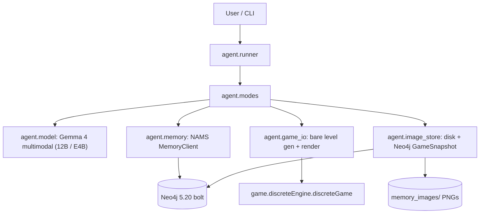
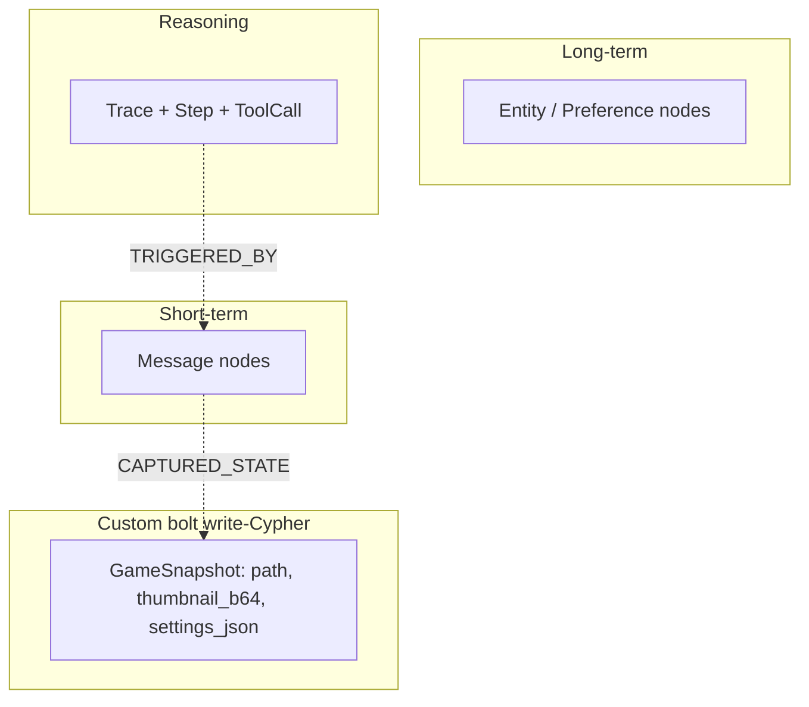

# game_saddle

A multimodal-LLM agent (Gemma 4 12B Unified by default, Gemma 4 E4B as the
lighter alternative; pick via `MODEL_KEY` or the notebooks' model dropdown —
`MODEL_CANDIDATES.md` records the bake-off that settled the lineup) that
plays a small 2D discrete game, with
persistent, graph-shaped memory backed by the **Neo4j Agent Memory System
(NAMS)** running locally over Bolt. No external DB, no NAMS API key, no
cloud LLM provider.

The game itself lives in `game/discreteEngine.py`. Its world is **y-up**
(larger y = higher on screen, as in ordinary graphs) and the facing angle
theta is a **compass bearing**: 0 = straight up (12 o'clock), measured
**clockwise** on screen — the engine, the Settings JSON, and every prompt
share this one convention (see the docstring of `agent/game_io.py`). For now the agent only sees **bare
levels**: four boundary walls, exactly one gold piece near the agent,
generated via `discreteGame.random_bare_settings()`. See `FUTURE_GOALS.md`
for what is deliberately deferred.

## What it does

Three modes:

| Mode    | Command                          | What happens                                                                                                                                                |
|---------|----------------------------------|--------------------------------------------------------------------------------------------------------------------------------------------------------------|
| 1 game  | `python -m agent.runner game …`  | The agent sees a game screen **image** + a user question. It answers the question, makes one move, or (with `--solve`) loops moves until the gold is eaten. |
| 2 discuss | `python -m agent.runner discuss …` | Open-ended chat. The agent has **full access** to the entire memory DB. Use this to bootstrap the semantic model and to evaluate the agent conversationally. |
| 3 eval  | `python -m agent.runner eval …`  | Self-evaluation: looks at a recorded `Conversation` + its `Reasoning` traces + the `Settings` dict at each step, and writes a verdict back onto the same conversation. |

Available moves in mode 1: `CLOCK` (turn clockwise by π/30),
`ANTICLOCK` (turn counter-clockwise by π/30), `FORWARD` (advance up to
1/16 of the board in the facing direction).

## Architecture


```mermaid
flowchart TD
    User["User / CLI"] --> Runner["agent.runner"]
    Runner --> Modes["agent.modes"]
    Modes --> Model["agent.model: Gemma 4 multimodal (12B / E4B)"]
    Modes --> Memory["agent.memory: NAMS MemoryClient"]
    Modes --> GameIO["agent.game_io: bare level gen + render"]
    Modes --> ImgStore["agent.image_store: disk + Neo4j GameSnapshot"]
    Memory --> Neo4j[("Neo4j 5.20 bolt")]
    ImgStore --> Neo4j
    ImgStore --> Disk[("memory_images/ PNGs")]
    GameIO --> Engine["game.discreteEngine.discreteGame"]
```

### NAMS memory tiers and how we use them


```mermaid
flowchart TD
    subgraph short [Short-term]
        Msg["Message nodes"]
    end
    subgraph long [Long-term]
        Ent["Entity / Preference nodes"]
    end
    subgraph reason [Reasoning]
        Trace["Trace + Step + ToolCall"]
    end
    subgraph custom [Custom bolt write-Cypher]
        Snap["GameSnapshot: path, thumbnail_b64, settings_json"]
    end
    Msg -.->|CAPTURED_STATE| Snap
    Trace -.->|TRIGGERED_BY| Msg
```

* **short_term** — the conversation: user questions + assistant
  moves/answers (one `Message` per turn).
* **reasoning** — per-move `Trace` with a `Step` (thought = the model's
  raw output) and a `ToolCall` (tool name = `CLOCK`/`ANTICLOCK`/`FORWARD`,
  result = `{gold_collected: k}`). Mode 3 starts its own trace for the
  evaluation reasoning.
* **long_term** — a small semantic model of the game, seeded once by
  `python -m agent.runner seed`: entities (`Agent`, `Gold`,
  `BoundaryWall`, `DiscreteGame`, `Direction`) and preferences / tips
  (controls, geometry, goal, facing/distance/overshoot heuristics). We add
  these manually so NAMS needs **no LLM provider** (no `llm=` is passed),
  keeping the whole stack local. Auto-NER is off (`ExtractorType.NONE`);
  messages do not mint Entity nodes. Scene-play / scene-analyst / debrief
  system messages are a short role statement plus a labeled dump of
  numbered `core_player_*` / `core_analyst_*` Preference rows (exact
  category fetch, category-sort; not a reconstructed `SYSTEM_PROMPT_*`
  blob). The code seed in `agent/modes.py` is written at `seed` /
  `reset_memory_to_seed`; session load is read-only from NAMS (500+
  extras included if present). Analyst rows are stored `[ANALYST]`-tagged
  so they cannot leak into player context.
* **`GameSnapshot` (custom)** — written via `client.graph.execute_write`
  (bolt-only). Holds the filesystem `path`, `width`, `height`, a 64×64
  base64 PNG `thumbnail_b64`, and the full `settings_json`. Linked to the
  corresponding `Message` by `(:Message)-[:CAPTURED_STATE]->(:GameSnapshot)`.

### Per-move data flow (mode 1)

1. Render the current frame to `memory_images/<sid>/<snapshot_id>.png`;
   write a `GameSnapshot` node with `settings_json`.
2. Store the user question as a `Message` (role=user), linked to that
   snapshot via `CAPTURED_STATE {role:'before'}`.
3. Retrieve NAMS context with settings-leaking fields stripped
   (`agent.memory.get_game_context`).
4. Build the chat: system prompt + context + image + question; call the
   model.
5. Parse the first `CLOCK|ANTICLOCK|FORWARD` keyword; if found, apply the
   move to the engine.
6. Store the assistant `Message`; start a reasoning `Trace`, add a `Step`
   (thought=raw output), `record_tool_call` (action, gold_collected),
   `complete_trace`.
7. Render the post-move frame; write an `after` `GameSnapshot`; link it to
   the assistant message via `CAPTURED_STATE {role:'after'}`.
8. For `--solve`: loop until `len(game.settings.gold) == 0` (or
   `MAX_SOLVE_STEPS`). Recompute context with the new image each step.

**The `settings_json` is stored on the `GameSnapshot` node but is never
injected into the agent prompt in mode 1.** Mode 3 is the only mode that
sees Settings.

## Setup

1. **Python deps.** Use the setup script — it runs `pip install` **and**
   downloads spaCy's `en_core_web_sm` and GLiNER's weights (pip cannot).
   Auto-NER is currently **off** (`ExtractorType.NONE` in
   `agent.memory.make_memory_settings`); the long-term graph is the five
   seeded entities plus Preference rows. The weights stay in the setup so
   a later re-enable does not stall mid-run:

   ```bash
   bash scripts/setup_env.sh
   ```

   If your host has NVIDIA driver < 580 (CUDA ≤ 12.x), install torch from
   the CUDA 12 index first, then run the setup script with `SKIP_TORCH=1`
   (see the note at the top of `requirements.txt`):

   ```bash
   pip install -U "torch>=2.7" torchvision torchaudio \
       --index-url https://download.pytorch.org/whl/cu124
   SKIP_TORCH=1 bash scripts/setup_env.sh
   ```

2. **Local Neo4j.** Either start the bundled compose stack:

   ```bash
   NEO4J_PASSWORD=changeme docker compose up -d neo4j
   ```

   …or point at an existing instance by setting `NEO4J_URI` /
   `NEO4J_PASSWORD` in `.env` (see `.env.example`) and skipping
   `docker compose up`. Bolt runs on `bolt://localhost:7687`; the browser
   UI is at `http://localhost:7474`.

   **Bare-metal Neo4j (no Docker, e.g. Vast.ai).** Rented GPU boxes often
   don't run a Docker daemon inside the container. Use the helper scripts in
   `scripts/` to run Neo4j directly instead:

   ```bash
   # Idempotent: installs Neo4j + OpenJDK 17 (if missing), configures bolt +
   # APOC, sets the password, starts the server, and writes the connection
   # vars into .env. Re-runnable.
   bash scripts/vast_neo4j_launch.sh

   # Sanity-check connectivity (direct bolt + a NAMS get_context round-trip):
   python scripts/neo4j_connect_diagnostic.py
   ```

   The password defaults to `changeme` (matching `.env.example`); override
   with `NEO4J_PASSWORD=… bash scripts/vast_neo4j_launch.sh`.

   **Known failure mode: thread exhaustion panics Neo4j (2026-08-15).**
   Vast containers cap *total threads*, not just processes, via cgroup
   `pids.max` (≈2800 observed) — far below the bare-metal `ulimit -u`.
   Datagen's 12 workers each spawn nproc-sized torch/OpenMP/tokenizer
   pools, and once the cap is reached Neo4j's Lucene merge scheduler fails
   with `OutOfMemoryError: unable to create native thread` mid-flush of a
   vector index (plenty of free RAM — the name is misleading), the database
   marks itself panicked, and every later transaction fails until restart.
   The fix is to cap the Python-side pools; the GPU does the heavy lifting,
   so this costs nothing. `vast_neo4j_launch.sh` writes the caps into
   `~/.bashrc` (new shells only — `source ~/.bashrc` for the current one):

   ```bash
   export OMP_NUM_THREADS=1 MKL_NUM_THREADS=1 OPENBLAS_NUM_THREADS=1
   export TOKENIZERS_PARALLELISM=false
   ```

   These must live in the shell environment, not the repo `.env`: dotenv
   loads at `agent.config` import time, which can be after torch has
   already sized its native pools. To check headroom while a run is up:
   `echo "pids: $(cat /sys/fs/cgroup/pids.current 2>/dev/null)/$(cat /sys/fs/cgroup/pids.max 2>/dev/null)"`.
   If Neo4j has already panicked, `neo4j stop && neo4j start` (or rerun the
   launch script) recovers it; the store itself was undamaged in the
   observed crash.

   Manage the bare-metal database with `scripts/neo4j_db.sh`:

   ```bash
   bash scripts/neo4j_db.sh status              # running state + bolt + node counts by label
   bash scripts/neo4j_db.sh save logs/mem.dump  # snapshot the graph (non-destructive)
   bash scripts/neo4j_db.sh wipe                # delete the graph, keep the password
   bash scripts/neo4j_db.sh load logs/mem.dump  # restore a saved graph
   ```

3. **Env file — the one place for credentials and config.**

   ```bash
   cp .env.example .env
   # edit .env: set NEO4J_PASSWORD, HF_TOKEN (needed for gated weights),
   # optionally MODEL_KEY (which registry model to load; gemma-4-12b default), ...
   ```

   Setting variables in `.env` is **enough**: everything that runs Python —
   the runner, the notebooks, and `scripts/setup_env.sh`'s model
   downloads — loads the repo-root `.env` via `python-dotenv` (anchored to
   the repo, not the cwd). There is no need to `export` OS environment
   variables or run `huggingface-cli login`. (Exported shell variables
   still work and take precedence if you have them, since `load_dotenv`
   does not override existing environment values.)

   If you copy an existing `.env` onto a fresh box, do it **before**
   running `scripts/setup_env.sh` so the HuggingFace downloads
   authenticate with your `HF_TOKEN`.

   The only exceptions are the pure-bash Neo4j admin scripts
   (`vast_neo4j_launch.sh`, `neo4j_db.sh`): they default to the
   `.env.example` password `changeme`, so pass
   `NEO4J_PASSWORD=… bash scripts/…` only if you changed it.
   `vast_neo4j_launch.sh` writes the connection vars it used into `.env`
   for you.

4. **Seed the semantic model** (run once):

   ```bash
   python -m agent.runner seed
   ```

## Usage

```bash
# Mode 1: ask one question about a fresh bare level
python -m agent.runner game --question "is the gold to your left or your right?"

# Mode 1: make the best move (single move)
python -m agent.runner game --question "make the best move"

# Mode 1: solve the game (loop moves until the gold is eaten)
python -m agent.runner game --question "solve the game" --solve

# Mode 2: open-ended discussion (full memory access)
python -m agent.runner discuss --text "What did you learn about CLOCK vs ANTICLOCK?"

# Mode 3: self-evaluate a recorded session
python -m agent.runner eval --session <session_id_printed_by_game>
```

`--session` is optional for `game` / `discuss` (a fresh UUID-based id is
generated and printed in the JSON output). `--session` is required for
`eval`.

## Logs & DB dumps

Logging is **on by default**. Every entry point (`InteractiveSession`, the
`game` / `discuss` / `eval` runner commands) creates a fresh, timestamped run
directory under `logs/` — e.g. `logs/play_2026-07-10_16-25-07/` — and writes:

* `llm_calls.{jsonl,txt}` — **every `model.generate` call**: the exact input
  (messages + the chat-templated `rendered_prompt`), sampling params, and the
  raw output. The `.jsonl` is the machine-readable source of truth; the `.txt`
  is a banner-delimited, human-readable transcript (same order).
* `db_retrieval.{jsonl,txt}` — **every memory retrieval**: which function
  (`get_recent_messages`, `client.get_context`, `get_semantic_model`,
  `_fetch_session_traces`), its arguments, and the result.

Logging never breaks a run — any write failure degrades to a one-time warning.
The implementation is [`agent/run_logging.py`](agent/run_logging.py); disable it
per session with `InteractiveSession(enable_logging=False)`.

**DB dump.** Snapshot the whole memory graph (all nodes + relationships) to a
`.dump` JSON file in the run directory, over the *live* bolt connection (does
**not** stop Neo4j, so it is safe mid-session). Embedding vectors are dropped by
default. From the `play.ipynb` **"Dump DB status"** cell, from a session
(`session.dump_db()`), or from the shell:

```bash
python -m agent.runner dump                 # -> logs/dump_<stamp>/db_snapshot_<stamp>.dump
python -m agent.runner dump --out my.dump    # explicit path
python -m agent.runner dump --embeddings     # keep the (large) embedding vectors
```

This logical JSON dump is for inspection/analysis and is distinct from the
native binary `neo4j-admin database dump` produced by `scripts/neo4j_db.sh save`
(which requires stopping Neo4j and is only loadable by `neo4j-admin`).

`logs/` and `*.dump` are git-ignored.

## Interactive notebooks

The Jupyter notebooks live in `notebooks/`: `play` (mode-1 play),
`interactive_self_eval` (the player/analyst loop, mode 3), `debrief`
(privileged post-game analysis, mode 4), `trace_viewer` (step through
recorded datagen traces — no GPU/NAMS needed), `noise_tuner` (tune the
image-noise magnitudes on a live board — no GPU/NAMS needed), and
`visualize_memory` (the memory graph). Install the extra deps (`pip install -r
requirements.txt` pulls in `ipywidgets` and `pyvis`) and launch Jupyter
from the repo root:

```bash
jupyter notebook   # or: jupyter lab
```

**Architecture + checkpoint dropdowns.** The play, debrief, and
interactive-self-eval notebooks all start their control panel with a shared
model picker (`agent.notebook_ui.model_picker`): an **Architecture** dropdown
over every `agent.model.MODEL_REGISTRY` entry in recommendation order (see
`MODEL_CANDIDATES.md`), a **Checkpoint** dropdown listing `[default]` (bare
HuggingFace weights) plus every trained adapter found under
`weights/<architecture>/` (newest first, rescanned when the architecture
changes — see `training/TRAINING_OVERVIEW.md`), an explicit **Switch model**
button (a
misclick on a dropdown never starts a download), and a **"Save only one set
of weights at a time"** checkbox. Unchecked (default), switching keeps the
conversation and leaves other models' weights cached on disk; checked, a
switch first restarts the conversation (debrief: a fresh thread over the same
play conversation), then deletes every other registry model's cached HF
weights before downloading the new ones — non-registry caches (GLiNER, spaCy,
sentence-transformers) and trained checkpoints under `weights/` are never
touched. The registry currently holds the two Gemma 4 variants (12B Unified,
E4B); the wider 2026-07 candidate field, and why it lost, is recorded in
`MODEL_CANDIDATES.md`.

* **`notebooks/play.ipynb`** — interactive mode-1 play. It holds **one
  persistent game** and **one conversation thread**. One click is **one
  generation**: the agent sees the *current* live frame plus its
  (settings-stripped) memory context and emits at most one move token
  (`[CLOCK]`, `[ANTICLOCK]`, `[FORWARD]`). Generation is stopped early the
  instant that token appears (HF `stop_strings`) and the move is applied.
  Ask again for the next move. A
  **"Restart conversation"** button re-initializes the env (a fresh bare level)
  and starts a new `session_id`. To discard an unwanted conversation and get
  back to the "semantic seeding only" state, either run the notebook's gated
  reset cell (`session.reset_memory_to_seed()`) or, from a shell,
  `bash scripts/reset_semantics.sh` (wipe + reseed). The heavy lifting lives in
  [`agent/interactive.py`](agent/interactive.py) (`InteractiveSession`),
  which runs the async NAMS client on a background event loop so the
  synchronous ipywidgets buttons can drive it. The mode-1 privacy invariant
  holds: the Settings dict is never fed to the model here.

* **`notebooks/debrief.ipynb`** — privileged post-game analysis. The analyst
  rubric matches self-eval (`RATING: -1.0..1.0`, `WRONG` spans, target /
  openings / `[END_GAME]`), plus navigation (`[SHOW]` / `[NEXT]` / `[BACK]`),
  search, and tip tools. Old recordings may still contain reflection
  messages; new play sessions do not produce them.

* **`notebooks/visualize_memory.ipynb`** — an interactive view of the memory
  graph via [`pyvis`](https://pyvis.readthedocs.io/). Pan/zoom/drag through all
  `Message`, `GameSnapshot`, `Trace`/`Step`/`ToolCall`, `Entity`, and
  `Preference` nodes and their relationships, with per-label captions and
  colors; hover a node to see its full property set. Set `SESSION_ID` in the
  per-session cell to scope the view to a single conversation. The graph is
  rendered as a self-contained `<iframe srcdoc>` with vis.js inlined, so it
  needs **no** Jupyter widget frontend extension (works in JupyterLab and
  Notebook 7, online or offline).

The play notebook's buttons do use `ipywidgets`; if they don't render, ensure
`ipywidgets` is installed in the same environment as the Jupyter server
(Notebook 7+ / JupyterLab 4+ ship the widget manager by default).

## Training

Everything training-related lives in `training/` — code, design docs, and
the remote-test checklist ([training/TO_TEST.md](training/TO_TEST.md)). Start
with [training/TRAINING_OVERVIEW.md](training/TRAINING_OVERVIEW.md) (roadmap,
recipe, checkpoint convention), then
[training/TRAINING_GAME_TRACES.md](training/TRAINING_GAME_TRACES.md) (how the
self-eval loop becomes training data),
[training/TRAINING_EXTRA_DATASETS.md](training/TRAINING_EXTRA_DATASETS.md)
(replay mixing against forgetting; the early-warning suite), and
[training/TRAINING_TRACE_EXTRAS.md](training/TRAINING_TRACE_EXTRAS.md)
(planted-error data, prompt internalization).

The loop lives in `training/train.py` as a **library**: a source-agnostic
QLoRA loop (weighted token cross-entropy over `TrainingExample`s from
pluggable `DataSource`s — plain SFT and RL-style per-token quality vectors
are the same code path) driven entirely by a `TrainConfig` dataclass. Each
concrete run is a short script that picks sources + config and calls
`run_training` — copy `training/run_first_iteration.py` per run. A generic
CLI front-end also exists for ad-hoc runs:

```bash
python -m training.run_first_iteration        # a configured run script
python -m training.train --data batch1.jsonl batch2.jsonl:0.5 --label ad-hoc
```

Checkpoints are **PEFT adapter folders** under
`weights/<architecture>/<name>/` (git-ignored; the directory is created by
`scripts/setup_env.sh`), saved periodically plus whenever training ends. Every
entry point can load one on top of the HF base weights: set
`MODEL_CHECKPOINT` in `.env`, pass `--checkpoint` to `agent.runner`,
`generate_game_traces`, or `run_weekend` (`python -m training.train` uses
`--resume-checkpoint` — a different CLI; that name is a hard error on
`run_weekend`), or use the checkpoint dropdown in the notebooks
(`[default]` = bare HF weights).
Training runs log to `logs/train_<label>_<stamp>/` (including a flat
`eval_log.jsonl` with every per-task eval metric per row, for graphing) and
roll back to the last good checkpoint (loudly) if a guarded eval metric
regresses hard (soft wobbles only warn; two-tier details in
`training/TRAINING_OVERVIEW.md`).

**Game-trace data generation** is
`python -m training.generate_game_traces --label iterN [--checkpoint ...]`:
the interactive self-eval loop run headlessly (player move, one analyst
exchange, round end; a game = gold eaten or `--max-moves` rounds, default
50) with mild label-safe
image noise at inference and a NAMS episodic reset every ~100 games (tips
survive). A `--question-rate` fraction of rounds (default 0.15) asks a
direction-balanced perception question ("Is the gold to your left?")
instead of a move — gradeable pressure on the known perception weak point. It writes `data_game/<label>/traces.jsonl` + stable frame copies
under `data_game/<label>/images/` (git-ignored; `setup_env.sh` creates
`data_game/`), plus `analyst_traces.jsonl` — the analyst's exact contexts
and analyses, which train as a KD-vs-frozen-base anchor
(`AnalystTraceSource`) so analyst behavior cannot silently drift while the
shared weights learn to play. Each player record stores the exact player
prompt, the raw reply
(the only trainable tokens — analyst text never enters player records),
and raw
annotations (rating, verified `WRONG:` spans, outcome, engine-oracle
facts). At training time `GameTraceSource` turns those into a per-reply
scale plus per-token shape — **single-sample offline REINFORCE with a
shaped per-token advantage (reward-weighted regression)**: the reply-wide
`example_weight` carries an exponential advantage over the corpus mean
rating plus a discounted `1.0 * 0.95^d` win boost (ground truth, sized to
dominate the analyst near a win), while span weights mark verified
`WRONG:` spans and oracle-contradicted move tokens at −0.5 (bounded
unlikelihood — active suppression with a floored objective) — and
re-noises the frames per run. Details and knobs in
[training/TRAINING_GAME_TRACES.md](training/TRAINING_GAME_TRACES.md).
The recorded long-term direction (staged, not scheduled) is **prompt
internalization**: context-distill the system prompt and then the
reasoning prose into the weights, until frame + terse request → bare move
token is the model's default behavior — staged plan in
[training/TRAINING_TRACE_EXTRAS.md](training/TRAINING_TRACE_EXTRAS.md).

**Intermission optimizations** (between phase 3 and the first real run):
datagen runs `--parallel 12` game sessions by default, merged into batched
decode calls on the one shared model (`agent/parallel_gen.py` — decode is
bandwidth-bound, so extra rows are cheap: measured 24.1 s/gen serial vs
6.4 at `--parallel 24`; mixed-length prompts batch via a verified left-pad
workaround for a Gemma 4 prefill bug, see the banner in
`agent/model.py`), and
finishes by writing signal-check plots to `logs/datagen_stats_<label>_*/`
(look at the rating histogram before spending training hours). Training
runs micro-batched (`micro_batch=4` x `grad_accum=4` = the same effective
batch 16), caps held-out eval at 100 examples per source, drops overlong
examples loudly (`max_example_chars`), and aborts after `--max-rollbacks`
(default 3) rollbacks instead of oscillating. The formal verification
protocol is `python -m training.selftest <t0..t9|all>` — ordered stages
printing `TEST <id> PASS/FAIL` lines; see
[training/TO_TEST.md](training/TO_TEST.md).

**External replay datasets** live in `data_external/` (git-ignored;
`scripts/setup_env.sh` creates it and runs
`python -m training.download_external`, which materializes every enabled
entry of the tracked manifest `training/datasets.json` — HF sets plus the
locally generated navigation set — and the fixed probe files). Layout:
`data_external/<name>/data.jsonl` (+ `images/`, `meta.json`) and
`data_external/probes/<name>_probe.jsonl`. Dataset roles, per-epoch quotas,
and the CE-vs-KD loss rationale are documented in
[training/TRAINING_EXTRA_DATASETS.md](training/TRAINING_EXTRA_DATASETS.md).

**Disk budget.** Materialized replay data is ~2–2.5 GB with the default
caps (budget 3–5 GB). The default `full` download mode additionally keeps
~20 GB of HF *dataset* cache (vqav2 alone is ~13.5 GB); `setup_env.sh`
switches to `stream` mode automatically when less than 60 GB is free
(recorded in `data_external/settings.json`), which skips that cache
entirely. On top of that: ~24 GB HF *model* cache for Gemma 4 12B, and
~0.3–1 GB per adapter checkpoint under `weights/`. Recommend **≥ 75 GB
free for the default full-download setup, ≥ 40 GB in stream mode**.

## Storing images in Neo4j: the approach used here

Neo4j's documented anti-pattern is storing large blobs (base64 PNGs, raw
byte arrays) as node properties — large properties force overflow record
chains and turn every node read into many extra disk I/Os. The
recommended practice is to store the binary on an external system
(filesystem / S3) and keep only a reference on the node.

We adopt the **hybrid** recommended option:

* the **full-resolution PNG** lives on disk under
  `memory_images/<session_id>/<snapshot_id>.png`;
* the `GameSnapshot` node stores the filesystem `path`, `width`,
  `height`, a small **64×64 base64 PNG thumbnail** in `thumbnail_b64`
  (small enough to avoid the BLOB penalty, big enough to preview in Neo4j
  Browser), and the full `settings_json`.

So the binary never bloats the property store, but you can still eyeball
each frame inline in the Neo4j Browser using `thumbnail_b64` (e.g. render
with `apoc.load.jpg` / a data-URI renderer), and the agent harness always
has the high-res frame on disk for re-feeding into the model.

## Schema sketch

```
(:Message {id, session_id, role, content, metadata, created_at})
(:GameSnapshot {id, session_id, path, width, height, thumbnail_b64,
                settings_json, label, created_at})
(:Trace {id, session_id, task, ...})          // NAMS reasoning
(:Step  {id, thought, ...})
(:ToolCall {tool, args, result, ...})
(:Entity {name, type, ...})                   // NAMS long-term POLE+O
(:Preference {category, preference, ...})

(:Message)-[:CAPTURED_STATE {role:"before"|"after"}]->(:GameSnapshot)
(:Trace)-[:TRIGGERED_BY]->(:Message)
```

## Notes / limitations

* Only **bare levels** (4 boundary walls + 1 gold piece, via
  `random_bare_settings`) are generated for **datagen**. A notebook-only
  multi-gold / openings variant lives in `notebooks/multi_gold_eval.ipynb`
  (see `FUTURE_GOALS.md` goal 2).
* The agent loop uses **image + text**. Audio/video comprehension is
  measurable with `python -m training.eval_av <checkpoint>` (LibriSpeech
  WER + NExT-QA); training-side KD replay is still future
  (`FUTURE_GOALS.md` goal 3).
* **Automatic finetuning dataset generation** from mode 1 + mode 3 is a
  future objective, not implemented here; see `FUTURE_GOALS.md`.
* **Deliberate agent-saved memory** (commit a novel in-game object to
  keep) is future; auto-NER is off (`FUTURE_GOALS.md` goals 8 and 12).
* The project is **local bolt-only by design**: there is no plan to add
  the hosted NAMS service or any external API key.
* The game package (`game/discreteEngine.py`, `game/levels/skeleton.py`)
  is owned by this repo and follows the y-up / clockwise-theta convention
  documented in `agent/game_io.py`; keep engine edits convention-consistent.

## Project layout

```
agent/
  __init__.py
  config.py          # env-driven AgentConfig
  model.py           # model registry + family adapters + VLModel wrapper (incl. generate_batch)
  parallel_gen.py    # cross-thread generation batching (dispatcher + session proxy)
  game_io.py         # bare level gen, Settings <-> dict, render to PNG, apply_action; multi-gold factory + openings oracle
  image_store.py     # disk PNG + 64x64 thumbnail b64 + GameSnapshot node + linking
  memory.py          # NAMS MemoryClient factory; context stripping; semantic-model seed; DB dump
  modes.py           # mode_game / mode_discuss / mode_self_eval
  interactive.py     # InteractiveSession: persistent-game mode-1 for notebooks
  multi_gold_session.py  # MultiGoldSelfEvalSession (notebook-only; 0–3 golds, openings, [END_GAME])
  run_logging.py     # per-run LLM-call + DB-retrieval logs (on by default)
  runner.py          # CLI
training/
  train.py           # the training LIBRARY: TrainConfig + run_training + generic CLI
  run_first_iteration.py    # run script template: sources + config -> run_training
  datasets.json      # tracked manifest of external replay datasets (ids, caps, loss kind)
  external_data.py   # manifest loader, per-dataset converters, ExternalSource
  download_external.py      # materializes data_external/ from the manifest (setup_env.sh runs it)
  synth_navigation.py       # seeded generator: clock/compass/bearing problems + probe
  probes.py          # exact-match capability probes (GSM8K, navigation) + guards
  generate_self_distill.py  # optional: regenerate replay targets with the base model
  eval_av.py         # audio/video comprehension: named checkpoint vs frozen Gemma 4 12B base
  generate_game_traces.py   # headless self-eval datagen -> data_game/<label>/
  game_traces.py     # GameTraceSource (traces -> REINFORCE-weighted examples) + AnalystTraceSource (KD anchor)
  planted_errors.py  # planted-error scrambler (labeled corruptions; not hooked up)
  image_noise.py     # label-safe frame degradation (inference + training)
  datagen_plots.py   # end-of-datagen signal-check plots -> logs/datagen_stats_*/
  selftest.py        # the formal test suite (stages t0-t9, TEST id PASS/FAIL lines)
  TRAINING_OVERVIEW.md      # self-training roadmap + the train.py contract/recipe
  TRAINING_GAME_TRACES.md   # standard use of game traces (self-eval loop as data generator)
  TRAINING_EXTRA_DATASETS.md# replay mixing vs. forgetting; the early-warning suite
  TRAINING_TRACE_EXTRAS.md  # planted-error data; prompt internalization
  TO_TEST.md         # remote-box verification checklist for the current stage
weights/             # trained adapter checkpoints, weights/<architecture>/<name>/ (git-ignored)
data_external/       # materialized replay datasets + probes (git-ignored; setup_env.sh)
data_game/           # generated self-eval game traces + frames (git-ignored; setup_env.sh)
notebooks/
  play.ipynb            # interactive mode-1 play (Ask + Restart conversation)
  interactive_self_eval.ipynb # player/analyst two-phase loop (mode 3)
  multi_gold_eval.ipynb     # multi-gold / openings self-eval (notebook-only)
  debrief.ipynb         # privileged post-game debrief (mode 4)
  trace_viewer.ipynb    # step through recorded datagen traces (no GPU/NAMS)
  noise_tuner.ipynb     # tune image-noise magnitudes by eye (no GPU/NAMS)
  visualize_memory.ipynb# pyvis interactive graph of the memory graph
scripts/
  vast_neo4j_launch.sh       # bare-metal Neo4j setup (no Docker; Vast.ai)
  neo4j_db.sh                # save / wipe / load / status for the bare-metal DB
  reset_semantics.sh         # wipe episodic memory + reseed semantics only
  neo4j_connect_diagnostic.py# bolt + NAMS connectivity probe
logs/                # per-run logs + .dump snapshots (git-ignored)
docker-compose.yml   # local Neo4j 5.20 community (bolt + APOC)
requirements.txt
README.md
FUTURE_GOALS.md
MODEL_CANDIDATES.md    # comparable multimodal models for the fine-tuning bake-off
IMAGE_DECODER_GRAFT.md # how-to: graft an image decoder (visual imagination) onto the VLM
.env.example
```
